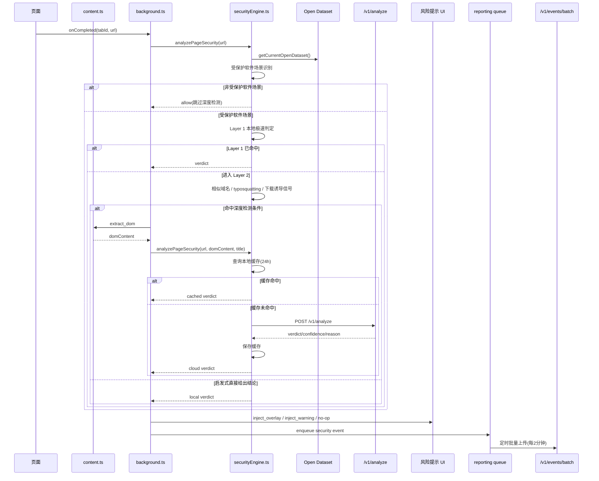

# SKUNKED 企业反钓鱼插件

SKUNKED 是面向企业场景的 Chrome 反钓鱼扩展。插件安装后立即生效，默认无需员工配置模型或 API Key。

## 核心目标

1. **识别准确**：本地三层检测 + 云端语义判定。
2. **异步高性能**：页面主线程轻量提取，云判定异步执行。
3. **友好克制**：高风险阻断、中风险告警、低风险放行。
4. **企业可运营**：支持激活码绑定组织、事件上报、导出对接。
5. **数据集驱动**：检测规则与数据解耦，支持公开数据集持续更新。

## 当前架构（MVP）

- 扩展端：Plasmo + React + TypeScript（MV3）。
- 云端：Cloudflare Worker + D1 + KV（OpenAI 兼容模型接口）。
- 公开数据：独立 Open Data 服务，提供应用官网目录与确认钓鱼域名。
- 判定协议（统一）：
  - `verdict`: `allow | warn | block`
  - `confidence`: `0-100`
  - `reason`: 判定理由
  - `modelTraceId?`, `matchedBrand?`

## 检测链路

1. **Layer 1（本地极速）**
   - 官方域名白名单直接放行。
   - 本地黑名单直接阻断。
2. **Layer 2（启发式）**
   - 域名相似度与 typosquatting 检测。
   - 敏感关键词触发云分析。
3. **Layer 3（云语义）**
   - 上传最小特征（标题、按钮词、关键词摘要）。
   - 返回统一风险判定并缓存 24 小时。
4. **Open Dataset（公开数据层）**
   - 独立公共数据集与只读 API，不依赖企业云 D1。
   - 公开应用官网域名与确认钓鱼域名。
   - 插件启动时与每 6 小时同步，离线自动回退本地快照。

## 钓鱼网站分析流程（含时序图与异常分支）

### 主流程（页面维度）

1. 用户打开页面后，`background` 在 `webNavigation.onCompleted` 触发分析。
2. `securityEngine` 先做 URL 级预筛选（无需 DOM）：只有命中 open-data 支持的软件品牌信号，才会进入深度检测。
3. 仅在需要云语义复核时，`content` 脚本再提取最小 DOM 特征（`title`、`h1`、按钮词、下载关键词等）。
4. 在命中范围内执行三层判定：Layer 1 本地极速、Layer 2 启发式、Layer 3 云语义。
5. 判定结果统一为 `allow | warn | block`，并携带 `confidence/reason/layer`。
6. `block` 注入全屏拦截层，`warn` 注入顶部告警条，`allow` 仅记录状态不打断访问。
7. 每次决策都会进入事件队列，等待后台批量上报到云端。

### 时序图（核心链路）



### 异常与降级分支

| 场景 | 当前处理方式 | 结果 |
| --- | --- | --- |
| DOM 提取失败（content 响应失败） | `background` 直接结束本次分析 | 页面不中断；本次不注入风险 UI |
| 云分析超时或请求失败 | Layer 3 返回降级结果：默认低风险放行（阈值以下）并记录原因 | 避免因云端抖动导致批量误报 |
| 云策略同步失败 | 保持本地现有策略（默认阈值 `warn=60`、`block=90`） | 分析继续，不影响插件可用性 |
| 公开数据集同步失败 | 优先保留已有数据集；若本地为空则回退内置快照 | 白名单/黑名单能力不丢失 |
| 事件上报失败 | 事件留在队列中重试（最多 5 次） | 不影响前台防护，审计最终一致 |
| 用户手动“继续访问”风险页 | 记录 `risk_bypassed` 事件并保留角标提醒 | 不强制阻断，但保留追踪与提示 |

### 周期任务（后台）

- **策略同步**：每 30 分钟拉取一次组织策略（激活后生效）。
- **公开数据集同步**：每 6 小时同步一次 `apps + confirmed phishing`。
- **事件上报**：每 2 分钟批量上传一次本地风险事件队列。

## 项目结构

Monorepo 工作区（pnpm workspace）包含以下包：

| 包名 | 路径 | 说明 |
| --- | --- | --- |
| `skunked-extension` | `.` | Chrome 扩展（Plasmo） |
| `skunked-cloud-api` | `cloudflare-worker/` | 企业云端 API（激活、策略、语义研判、事件） |
| `skunked-open-data` | `open-data/` | 独立公开数据集、schema 与发布元数据 |
| `skunked-site` | `site/` | 落地页与数据集浏览页 |

```txt
.
├── src/                      # Chrome 扩展源码
│   ├── background.ts         # 后台主流程（分析、策略、上报）
│   ├── content.ts            # 页面提示 UI 注入
│   ├── popup.tsx             # 插件弹窗
│   ├── options.tsx           # 企业激活与运维面板
│   └── services/             # 检测、云调用、上报、数据集同步
├── open-data/                # 独立公开数据集（apps/phishing/manifest/schema）
├── cloudflare-worker/        # 企业云端 API（激活、策略、事件、分析）
├── site/                     # 落地页与公开数据展示页
└── docs/                     # 企业部署、隐私、云端与 open-data API 文档
```

## 统一脚本

根目录与各子包遵循相同脚本契约：

| 脚本 | 根目录 | 说明 |
| --- | --- | --- |
| `dev` | 扩展开发 | `pnpm dev:worker` / `pnpm dev:site` 启动其他包 |
| `build` | 扩展构建 | `pnpm build:all` 构建全部包 |
| `typecheck` | 扩展类型检查 | `pnpm typecheck:all` 检查全部包 |
| `lint` | ESLint（TS + import 排序，兼容 Prettier） | `pnpm lint:all` 检查全部包 |
| `test` | Vitest 单元测试（纯逻辑模块） | `pnpm test:open-data` 校验公开数据集；`pnpm test:all` 运行全部 |
| `format:check` | Prettier 格式检查 | `pnpm format:check:all` 检查全部包 |

## 公开数据集命令

```bash
pnpm open-data:validate
pnpm open-data:build
```

## 本地开发

```bash
pnpm install
pnpm dev
pnpm dev:worker   # 可选：云端 API
pnpm dev:site     # 可选：静态站点
pnpm build
pnpm typecheck:all
pnpm test
```

加载方式：

1. 打开 `chrome://extensions`
2. 开启开发者模式
3. 加载 `build/chrome-mv3-dev`

## Cloudflare Worker（可选本地联调）

```bash
cd cloudflare-worker
pnpm install
pnpm dev
```

部署前请配置：

- `MODEL_API_KEY`（Worker Secret）
- `INTERNAL_EXPORT_KEY`（导出接口密钥）
- D1 与 KV 绑定 ID

公开数据服务使用独立 base URL。扩展默认读取
`PLASMO_PUBLIC_OPEN_DATA_API_BASE_URL`，不从企业云 API 或租户 endpoint 拉取
open-data。

## 企业发布流程（推荐）

1. 发布到 Chrome Web Store。
2. 企业通过 `ExtensionInstallForcelist` 强制安装。
3. 管理员在插件 `Options` 页输入激活码，启用组织策略与审计。

详细文档：

- [企业部署手册](./docs/enterprise-deployment.md)
- [云端 API 文档](./docs/cloud-api.md)
- [Open Data API 文档](./docs/open-data-api.md)
- [隐私与数据处理说明](./docs/privacy-policy.md)
- [公开数据集贡献指南](./CONTRIBUTING_DATASET.md)

## 许可证

代码采用 [Apache License 2.0](./LICENSE)。公开数据集采用 [CC BY 4.0](./open-data/LICENSE.md)。
